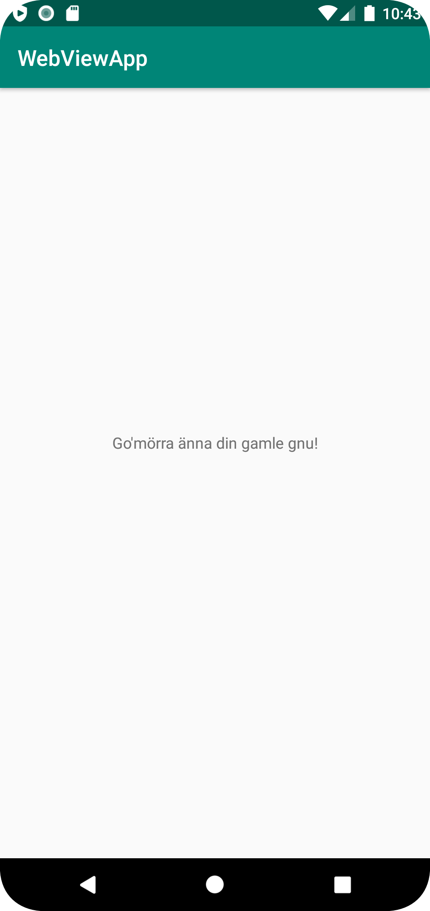

# Rapport

I denna uppgift ändrades texten i XML-filen "content_main.xml" från "Hello World!" till "Go'mörra änna din gamle gnu!".
Efter att appen testats och kontrollerats commitades och pushades filen till denna GitHub repository. Efter det firade jag med ett par salsa-steg.

Nedan visas den altererade kodensnutten i XML-filen:

```
   <TextView
        android:layout_width="wrap_content"
        android:layout_height="wrap_content"
        android:text="Go'mörra änna din gamle gnu!"
        app:layout_constraintBottom_toBottomOf="parent"
        app:layout_constraintLeft_toLeftOf="parent"
        app:layout_constraintRight_toRightOf="parent"
        app:layout_constraintTop_toTopOf="parent" />
```
Med "layout_width" och "layout_height" satt till "wrap_content" blir textelementet
precis lika hög och bred som texten. Rad 3 är den rad där text-outputen ändrats.

Nedan finns en skärmdump bifogad på förändingen.

